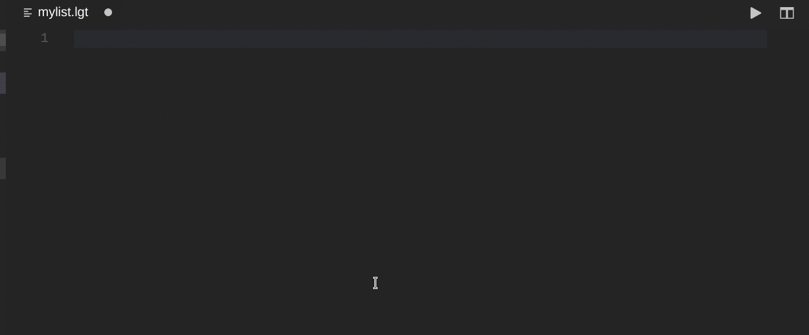
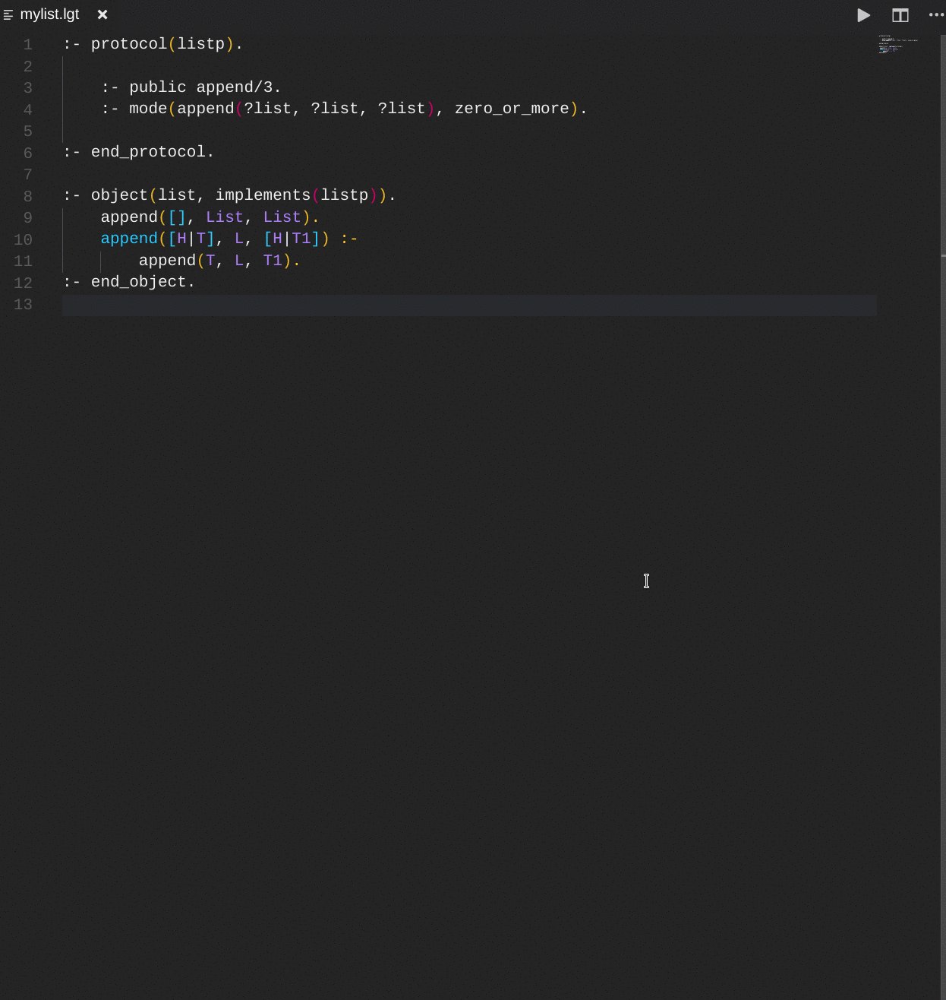

# VSC-Logtalk

A VS Code extension which provides language support for Logtalk.

---

[Features](#features) | [Configurations](#configurations) | [Bug Reporting](https://github.com/arthwang/vsc-logtalk/issues)

---

## Note before installation

This extension can be installed via extensions viewlet of VS Code or 'Extensions: install extension' command from the command palette. The author notices that it is developed and tested in **_Logtalk 3.12.0_** and **_VS Code 1.17_** on **_Debian 9.0_** (stretch). It's not yet tested under other environments.

## Features

* [Syntax highlighting](#syntax-highlighting)
* [Snippets](#indentation-snippets-and-auto-completion)
* [Grammar Linter](#grammar-linter)
* [Commands](#commands)

## Feature descriptions and usages

### Syntax highlighting

* Full syntax highlight for all Logtalk built-in control constructs, directives, methods, and predicates
* Full syntax highlight for all ISO Prolog standard built-in control constructs, directives, and predicates
* Built-ins pattern support

### Indentation, snippets and auto-completion

* Indentation after new line
* Built-in directive, method and predicate template auto-completion
* Auto-complete recursive parameters: When '.'(dot) occures as first non-space character, VSC-Logtalk will repeat the nearest above head of clause and automatically change the parameters if possible.

> Note: Relations between entities use choice snippets. 'orel' triggers object relation choices and 'crel' for category. There is only one relation between protocols 'extends', so 'ext' will trigger the snippet.

> The snippets for built-ins all are triggered by natural prefix, i.e. ':- public' triggers ':- public()' directive. You needn't to type all charaters to show up the suggestion list.

> Refter to the table below for other snippets:

|    Prefix | Description                          |
| --------: | ------------------------------------ |
|    :- obj | Object                               |
|    :- cat | Category                             |
|    :- pro | Protocol                             |
|      orel | relations between objects(choice)    |
|      crel | relations between categories(choice) |
|       ext | relations between categories         |
|  category | Category with protocol               |
|  category | Category                             |
|     class | Class with all                       |
|     class | Class with category                  |
|     class | Class with metaclass                 |
|     class | Class with protocol                  |
|     class | Class                                |
|  category | Complementing category               |
|  category | Extended category                    |
|  protocol | Extended protocol                    |
|  instance | Instance with all                    |
|  instance | Instance with category               |
|  instance | Instance with protocol               |
|  instance | Instance                             |
|   private | (with no arguments)                  |
|   private | Private predicate                    |
| protected | (with no arguments)                  |
| protected | Protected predicate                  |
|  protocol | Protocol                             |
|    object | Prototype with all                   |
|    object | Prototype with category              |
|    object | Prototype with parent                |
|    object | Prototype with protocol              |
|    object | Prototype                            |
|    public | (with no arguments)                  |
|    public | Public predicate                     |

### Grammar linter

* The grammar errors (if any) will display in OUTPUT channel when active source file is saved.

* Command 'Goto next/previous error': see section Commands below.

### Commands

#### Project specified commands

Project specified commands can be triggered from command palette via entering 'logtalk' to pop up the list of all commands of VSC-Logtalk.

|      Command | Description                                                  | Key binding |
| -----------: | :----------------------------------------------------------- | :---------- |
| Open Logtalk | Opens Logtalk in an integrated terminal                      | alt-x o     |
|  Run Testers | Runs the logtalk_tester script on the project root directory |             |
|  Run Doclets | Runs the logtalk_doclet script on the project root directory |             |

### Source file specified commands

These commands can be triggered from editor/context and explorer/context menus via right click editor area or Logtalk files in explorer area respectively. In explorer context, the file name at which right click occurs will be passed in the command as argument. File specified commands can also be triggered from command palette so that active file name in the editor will be passed in the command.

|                  Command | Description                                                                                                                                              | Key binding |
| -----------------------: | :------------------------------------------------------------------------------------------------------------------------------------------------------- | :---------- |
|            Load Document | Loads the active source file into the Logtalk process                                                                                                    | F9          |
|                Run Tests | Runs the tester file under the active source file directory                                                                                              |             |
|               Run Doclet | Run the doclet file under the active source file directory                                                                                               |             |
| Goto Next/Previous Error | Locate cursor to the nearest line with error/warning from current cursor location and the corresponding error/warning message displays in output channel | F7/shift-F7 |
|           Scan Dead Code | Scans active file for dead code                                                                                                                          |             |
|   Generate Documentation | Generates documentation for the files under the active source file directory                                                                             |             |
|        Generate Diagrams | Generates diagrams for the files under the active source file directory                                                                                  |             |

* Command 'Logtalk: load document'

## Configurations

* The user can configure settings via VS Code menu File/Preferences/Settings. Entering 'logtalk' in the input box will show up Logtalk settings. The settings in this extension with their default values are:

  * "logtalk.executable": "/usr/local/bin/logtalk"

    This setting points to the Logtalk executable, which can be created by running the `logtalk_backend_select` script. In alternative, use the absolute path to the integration script you want to use, e.g. `swilgt` or `swilgt.sh`.

  * "logtalk.executable.arguments": [ ]

    Arguments of Logtalk executable run in terminal.

  * "logtalk.tester.script": "/usr/local/bin/logtalk_tester"

    Automation script for running tests.

  * "logtalk.tester.arguments": [ ]

    Arguments for the automation script for running tests.

  * "logtalk.doclet.script": "/usr/local/bin/logtalk_doclet"

    Automation script for running doclets.

  * "logtalk.documentation.arguments": [ ]

    Arguments for the automation script for running doclets.

  * "logtalk.documentation.script": "/usr/local/bin/lgt2html"

    Script for converting the XML files generated by the Logtalk `lgtdoc` tool.

  * "logtalk.documentation.arguments": [ ]

    Arguments for the script that converts the XML files generated by the Logtalk `lgtdoc` tool.

  * "logtalk.graphviz.executable": "/usr/local/bin/dot"

    Graphviz executable for converting the `.dot` files generated by the Logtalk `diagrams` tool.

  * "logtalk.graphviz.arguments": ["-Tsvg"]

    Arguments for the Graphviz executable that converts the `.dot` files generated by the Logtalk `diagrams` tool.

  * "logtalk.graphviz.extension": ["svg"]

    File name extension for the diagram files generated by the Graphviz executable.

## Bug reporting

Feel free to report bugs or suggestions via [issues](https://github.com/arthwang/vsc-logtalk/issues)

## Development 

This extension has been package and tested with node v14.17.5 (latest LTS).
You may install the extension directly from the .vsix file included in this repo.

`vsix:make` makes the .vsix file, `vsix:install` installs it.

## Contributions

[Pull requests](https://github.com/arthwang/vsc-logtalk/pulls) are welcome.

## Acknowledgements

The author of this extension thanks Professor Paulo Moura who is the author of Logtalk for his patient help and support. Syntax highlighting, some snippets, and some commands are integrated from his distro of Logtalk.

## License

[MIT](http://www.opensource.org/licenses/mit-license.php)
